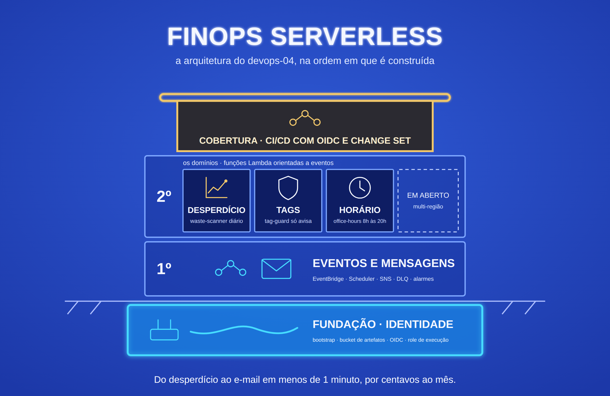

# devops-04-serverless-finops

Automação de FinOps orientada a eventos na AWS: uma varredura diária que
encontra recursos cobrando sem uso, um guarda que avisa quando uma instância
sobe sem as tags de custo e um liga/desliga por horário para ambientes de
desenvolvimento. Tudo em CloudFormation, com deploy por change set via OIDC.

**Projeto 4 de 5 do portfólio DevOps** · Nível: intermediário/avançado ·
Anterior: [devops-03-eks-gitops](https://github.com/robson-devops/devops-03-eks-gitops)


## Stack

`AWS Lambda` `EventBridge` `EventBridge Scheduler` `SNS` `SQS (DLQ)` `CloudWatch Alarms` `S3` `CloudFormation` `GitHub Actions` `OIDC` `Python 3.13` `pytest` `moto`

## O que este projeto acrescenta aos anteriores

| Projetos 1 a 3 | Projeto 4 |
|---|---|
| Terraform | CloudFormation, para mostrar que a escolha do Terraform foi decisão e não hábito |
| Serviços sempre ligados (EC2, ECS, EKS) | Nenhum servidor; custo praticamente zero com tudo no ar |
| `verificar-cobranca.sh` rodado à mão depois do destroy | A mesma ideia virou um serviço que vigia a conta todo dia |
| Deploy disparado pelo pipeline com permissão sobre os recursos | Pipeline só pede o change set; quem cria os recursos é o CloudFormation, com uma role de execução |
| Alertas sobre a aplicação | Alertas sobre custo e conformidade da conta |

## Arquitetura

Diagrama e fluxos em [`docs/architecture.md`](docs/architecture.md).

```
Scheduler 08h ──> waste-scanner ──> relatório JSON no S3 + e-mail (só se achar algo)
EC2 "running" ──> EventBridge ──> tag-guard ──> tag TagCompliance + e-mail
Scheduler 08h/20h (seg a sex) ──> office-hours ──> start/stop nas instâncias com Schedule=office-hours
falha de função ──> 2 novas tentativas ──> DLQ ──> alarme ──> e-mail
```

## Decisões de Arquitetura

**CloudFormation puro, sem SAM.** O card do portfólio prometia uma segunda
ferramenta de IaC. O SAM esconderia boa parte do que se quer mostrar (roles,
permissões de invocação, log groups). O código das funções sobe com
`aws cloudformation package`, que troca a pasta local por um objeto no S3.

**Pipeline sem poder de criar recursos.** A role do GitHub Actions só cria e
executa change sets na stack `devops-04-app`, envia o pacote para o bucket de
artefatos e entrega a role de execução ao CloudFormation. Quem cria Lambda, IAM
e S3 é o CloudFormation assumindo a `devops-04-cfn-execution`, que por sua vez
só alcança recursos com o prefixo `devops-04-`.

**Uma role por função, com o mínimo.** O `waste-scanner` só lê. O `tag-guard`
só consegue escrever a tag `TagCompliance` (condição `aws:TagKeys`). O
`office-hours` só para ou liga instâncias com `Schedule=office-hours`
(condição `aws:ResourceTag/Schedule`): mesmo com um bug no código, ele não
alcança nenhuma outra instância.

**O `tag-guard` só avisa.** Parar a instância de alguém por falta de tag
derruba o que pode ser produção. A instância é marcada e o dono é avisado; a
decisão fica com quem é responsável por ela.

**E-mail só quando há o que dizer.** A varredura grava o relatório todo dia,
mas só manda e-mail quando encontra desperdício. Aviso diário de "nada
encontrado" vira ruído e treina as pessoas a ignorar o remetente.

**Nenhum evento se perde em silêncio.** Agendamentos e regras do EventBridge
têm 2 novas tentativas; a função tem DLQ. O que falhar mesmo assim fica na
fila `devops-04-dlq` com o evento original e o motivo do erro, e um alarme
avisa por e-mail.

**Tópico SNS sem criptografia em repouso.** Alarmes do CloudWatch não
publicam em tópico cifrado com a chave gerenciada `aws/sns`, e uma chave KMS
própria fica até 7 dias pendente de exclusão depois do destroy. As mensagens
são resumos sem dado sensível, e a policy do tópico exige TLS.

**Assinatura de e-mail protegida contra cancelamento.** Na validação, a
assinatura foi cancelada por um clique no link "unsubscribe" do rodapé. A
confirmação é feita pela CLI com `--authenticate-on-unsubscribe true`: daí em
diante, cancelar exige credencial da AWS.

**Log groups criados antes das funções.** Se a Lambda criasse o próprio log
group, ele nasceria sem retenção e fora da stack, sobrevivendo ao destroy.

**arm64.** Graviton custa menos por milissegundo e as funções são Python puro,
sem dependência nativa.

## Trade-offs Avaliados

| Decisão | Escolhido | Alternativa | Critério |
|---|---|---|---|
| IaC | CloudFormation | Terraform / SAM / CDK | Segunda ferramenta do portfólio, sem a abstração do SAM |
| Agendamento | EventBridge Scheduler | Regra `cron` do EventBridge | Fuso horário nativo (America/Sao_Paulo), retry e DLQ por agendamento |
| Ação do tag-guard | Marcar e avisar | Parar a instância | Remediação automática destrutiva exige acordo com os donos |
| Preço dos achados | Tabela de referência no código | AWS Pricing API | Serve para ordenar e dimensionar; a Pricing API acrescenta permissão e latência sem mudar a decisão |
| Criptografia do SNS | Sem SSE, com TLS obrigatório | KMS próprio | Alarmes não publicam com `aws/sns`; KMS próprio sobra 7 dias após o destroy |
| Concorrência reservada | Não usada | `ReservedConcurrentExecutions` | Conta nova tem limite de 10 e a reserva pode falhar; as funções rodam poucas vezes por dia |
| Funções em VPC | Não | VPC com endpoints | Só chamam APIs públicas da AWS; VPC exigiria NAT ou endpoints pagos |
| Testes | `moto` simulando a AWS | Testes contra a conta real | Rodam no pipeline sem credencial e em segundos |

## Melhorias Mensuráveis

Medido na AWS em 01/10/2026:

| Métrica | Resultado |
|---|---|
| Desperdício de teste encontrado (2 EIPs, 1 volume, 1 log group) | **4 de 4**, ~US$ 7,38/mês estimados |
| Execução da varredura | **~2 s**, e-mail no mesmo minuto |
| Conta limpa | **0 achados e nenhum e-mail** |
| Instância sem tags até o e-mail do tag-guard | **< 1 min** após o `run-instances` |
| Erro de função até o e-mail do alarme | **39 s** |
| Evento com falha | **3 tentativas** e o evento guardado na DLQ com o motivo |
| Pipeline com mudança de código | **1 min 59 s** do push até a função atualizada |
| Encerramento completo (`encerrar.sh`) | **3 min 18 s** |
| Recursos na conta depois do encerramento | **0**, verificado pelo `scripts/verificar-cobranca.sh` |
| Testes unitários | **12** passando |
| Varredura `checkov` | CloudFormation **85 passaram, 0 falharam** (17 exceções justificadas); workflow **60 / 0** |

Como cada número foi obtido: [`docs/validacao-aws.md`](docs/validacao-aws.md).

## Limitações Conhecidas

- **Uma região.** As funções olham só a região onde rodam. Cobrir a conta
  inteira exige iterar regiões ou fazer o deploy por StackSets.
- **Preços aproximados.** A tabela do `waste-scanner` usa preços da us-east-1;
  o custo de snapshot usa o tamanho do volume como teto, porque snapshots são
  incrementais.
- **tag-guard só para EC2.** Outros recursos sem tag (RDS, buckets) não são
  vigiados.
- **office-hours sem feriados.** O agendamento é de segunda a sexta.
  Instâncias de um Auto Scaling Group seriam recolocadas pelo próprio grupo.
- **Alertas só por e-mail.** Integração com Slack ou Teams ficaria num
  assinante a mais do tópico.

## Estrutura

```
.
├── bootstrap/bootstrap.yaml   # bucket de artefatos, OIDC, roles do pipeline e de execução
├── infra/template.yaml        # funções, agendamentos, regra, SNS, DLQ, alarmes
├── src/
│   ├── waste_scanner/app.py
│   ├── tag_guard/app.py
│   └── office_hours/app.py
├── tests/                     # pytest + moto
├── scripts/
│   ├── encerrar.sh            # apaga tudo na ordem certa
│   └── verificar-cobranca.sh  # confere que nada ficou na conta
├── .github/workflows/ci-cd.yml
├── pyproject.toml · requirements-dev.txt
└── docs/                      # arquitetura e validação na AWS
```

## Custo

Praticamente zero. Lambda, EventBridge, Scheduler, SNS por e-mail, SQS e
alarmes ficam no free tier ou em centavos por mês nesse volume. O único custo
real dos testes foram as instâncias t4g.nano e os Elastic IPs criados de
propósito, por alguns minutos.

## Pré-requisitos

### Ferramentas

AWS CLI, GitHub CLI (`gh`), `git` e Python 3.13 para rodar os testes.

> Na AWS CLI v2, o `aws lambda invoke --payload '{...}'` precisa também de
> `--cli-binary-format raw-in-base64-out`. Os exemplos abaixo foram executados
> na v1, que não exige esse parâmetro.

### Identidades

| Identidade | O que é | Como obter |
|---|---|---|
| **Operador** | Quem cria as stacks | Usuário IAM seu, com permissão em CloudFormation, IAM (roles e provider OIDC), S3, Lambda, EventBridge, Scheduler, SNS, SQS, CloudWatch e Logs |
| **Pipeline** | O GitHub Actions | Role `devops-04-pipeline`, criada pelo bootstrap |
| **CloudFormation** | Quem cria os recursos da aplicação | Role `devops-04-cfn-execution`, criada pelo bootstrap |
| **Funções** | Cada Lambda | Uma role por função, criada pela stack da aplicação |

### Login na AWS e no GitHub

```bash
aws configure            # ou aws configure sso + aws sso login
aws sts get-caller-identity
gh auth login
```

### Provider OIDC do GitHub

Ele é único por conta. Se outro projeto já o criou, use
`CreateOidcProvider=false` no passo 1:

```bash
aws iam list-open-id-connect-providers \
  --query "OpenIDConnectProviderList[?contains(Arn, 'token.actions.githubusercontent.com')].Arn" \
  --output text
```

### Se você fez fork

Troque `robson-devops/devops-04-serverless-finops` pelo seu repositório no
parâmetro `GitHubRepository` do passo 1 e nos comandos `gh`.

## Como executar

Todos os comandos rodam da raiz do projeto, na região us-east-1.

**1. Bootstrap.** Cria o bucket de artefatos, o provider OIDC e as roles do
pipeline e de execução.

```bash
aws cloudformation deploy \
  --template-file bootstrap/bootstrap.yaml \
  --stack-name devops-04-bootstrap \
  --capabilities CAPABILITY_NAMED_IAM \
  --tags Project=devops-04 \
  --region us-east-1
```

**2. Primeira publicação da aplicação.** O e-mail entra só como parâmetro; os
deploys seguintes reaproveitam o valor.

```bash
ARTIFACT_BUCKET=$(aws cloudformation describe-stacks \
  --stack-name devops-04-bootstrap \
  --query "Stacks[0].Outputs[?OutputKey=='ArtifactBucketName'].OutputValue" \
  --output text --region us-east-1)
EXEC_ROLE=$(aws cloudformation describe-stacks \
  --stack-name devops-04-bootstrap \
  --query "Stacks[0].Outputs[?OutputKey=='CfnExecutionRoleArn'].OutputValue" \
  --output text --region us-east-1)

mkdir -p .build
aws cloudformation package \
  --template-file infra/template.yaml \
  --s3-bucket "$ARTIFACT_BUCKET" \
  --s3-prefix app \
  --output-template-file .build/packaged.yaml \
  --region us-east-1

aws cloudformation deploy \
  --template-file .build/packaged.yaml \
  --stack-name devops-04-app \
  --role-arn "$EXEC_ROLE" \
  --capabilities CAPABILITY_NAMED_IAM \
  --parameter-overrides AlertEmail=voce@exemplo.com \
  --tags Project=devops-04 \
  --region us-east-1
```

**3. Confirmar a assinatura sem clicar no link.** Chega o e-mail "AWS
Notification - Subscription Confirmation". Copie o endereço do link *Confirm
subscription* (botão direito, copiar endereço) e pegue o valor do parâmetro
`Token` dele. Confirmando pela CLI, cancelar a assinatura passa a exigir
credencial da AWS:

```bash
aws sns confirm-subscription \
  --topic-arn "arn:aws:sns:us-east-1:$(aws sts get-caller-identity --query Account --output text):devops-04-alerts" \
  --token "<valor do parâmetro Token>" \
  --authenticate-on-unsubscribe true \
  --region us-east-1
```

> Ao colar o link inteiro no zsh, o terminal escapa `?`, `=` e `&` com `\`.
> Cole só o valor do token.

**4. Configurar o pipeline.** O secret é o ARN da role; as variáveis não são
segredo.

```bash
gh secret set AWS_ROLE_ARN \
  --body "$(aws cloudformation describe-stacks \
      --stack-name devops-04-bootstrap \
      --query "Stacks[0].Outputs[?OutputKey=='PipelineRoleArn'].OutputValue" \
      --output text --region us-east-1)"
gh variable set ARTIFACT_BUCKET --body "$ARTIFACT_BUCKET"
gh variable set CFN_EXECUTION_ROLE_ARN --body "$EXEC_ROLE"
```

Daí em diante, todo push na `main` valida e publica.

### Testar as funções

```bash
# Varredura agora, sem esperar as 8h
aws lambda invoke --function-name devops-04-waste-scanner \
  --region us-east-1 /tmp/scan.json && cat /tmp/scan.json

# Parar e ligar as instâncias com Schedule=office-hours
aws lambda invoke --function-name devops-04-office-hours \
  --payload '{"action": "stop"}' --region us-east-1 /tmp/oh.json
aws lambda invoke --function-name devops-04-office-hours \
  --payload '{"action": "start"}' --region us-east-1 /tmp/oh.json
```

O `tag-guard` dispara sozinho quando qualquer instância entra em execução.
Procedimento completo de validação: [`docs/validacao-aws.md`](docs/validacao-aws.md).

### Encerrar sem deixar nada na conta

```bash
./scripts/encerrar.sh
./scripts/verificar-cobranca.sh us-east-1
```

O `encerrar.sh` esvazia o bucket de relatórios, apaga a stack da aplicação,
esvazia o bucket de artefatos com todas as versões e apaga o bootstrap. A
ordem importa: a stack da aplicação usa a role de execução que mora no
bootstrap, e o CloudFormation não apaga bucket com objetos.

Esperado no fim: `Nada encontrado nas regiões verificadas nem nos serviços globais.`

### Testes locais

```bash
python3 -m venv .venv && source .venv/bin/activate
pip install -r requirements-dev.txt
ruff check . && ruff format --check .
pytest -q
cfn-lint bootstrap/bootstrap.yaml infra/template.yaml
checkov -d . --framework cloudformation github_actions --quiet --compact
```
