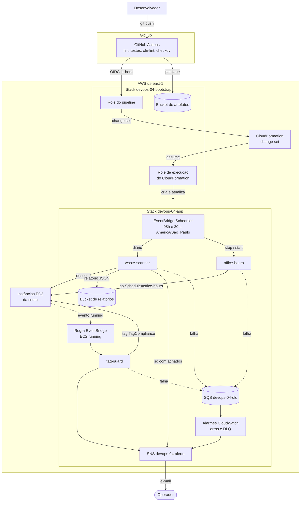

# Arquitetura: devops-04-serverless-finops

## Fluxo de deploy

1. O push na `main` dispara o workflow. O job `validate` roda ruff, pytest
   com `moto`, `cfn-lint` nos dois templates e checkov.
2. O job `deploy` troca o token OIDC do GitHub por credenciais de até 1 hora
   da role `devops-04-pipeline`.
3. `aws cloudformation package` compacta cada pasta de `src/`, envia ao bucket
   de artefatos e gera um template apontando para os objetos no S3.
4. `aws cloudformation deploy` cria e executa o change set, passando a role
   `devops-04-cfn-execution`. O CloudFormation assume essa role e cria ou
   atualiza os recursos; a role do pipeline nunca toca neles.

## Fluxo da varredura de desperdício

1. Todo dia às 8h (São Paulo) o Scheduler invoca o `waste-scanner` em modo
   assíncrono, com 2 novas tentativas e DLQ.
2. A função lista volumes soltos, Elastic IPs sem associação, snapshots com
   mais de 90 dias, instâncias paradas e log groups sem retenção.
3. Grava `reports/AAAA/MM/DD/waste-HHMMSS.json` no bucket de relatórios, que
   expira os objetos em 30 dias.
4. Se houver achados, publica um resumo no SNS, ordenado pelo custo mensal
   estimado.

## Fluxo de conformidade de tags

1. Quando uma instância EC2 entra em `running`, o EventBridge entrega o evento
   ao `tag-guard`.
2. A função lê as tags da instância e compara com `Project`, `Environment` e
   `Owner` (tag com valor em branco conta como ausente).
3. Se faltar alguma, escreve `TagCompliance=faltando:...` e publica o aviso.
   A instância continua rodando.

## Fluxo do liga/desliga

1. De segunda a sexta, às 20h o Scheduler envia `{"action": "stop"}` e às 8h
   `{"action": "start"}` ao `office-hours`.
2. A função filtra as instâncias com `Schedule=office-hours` no estado de
   origem (`running` para parar, `stopped` para ligar) e chama a API.
3. A role da função só tem `StopInstances` e `StartInstances` sob a condição
   `aws:ResourceTag/Schedule = office-hours`.

## Falhas e alarmes

| Situação | O que acontece |
|---|---|
| Função lança exceção | Alarme `devops-04-<função>-errors` vai para ALARM em cerca de 1 minuto e manda e-mail |
| Evento assíncrono falha 3 vezes | Evento original e motivo vão para a DLQ; alarme `devops-04-dlq-not-empty` avisa |
| Fila parada por muito tempo | A primeira métrica da SQS pode levar até 15 minutos para voltar, então o alarme da DLQ é mais lento na primeira vez |

## Camadas e responsáveis

| Camada | Stack | Arquivo |
|---|---|---|
| Bucket de artefatos, OIDC, roles do pipeline e de execução | `devops-04-bootstrap` | `bootstrap/bootstrap.yaml` |
| Funções, roles das funções, log groups, Scheduler, regra, SNS, SQS, alarmes, bucket de relatórios | `devops-04-app` | `infra/template.yaml` |
